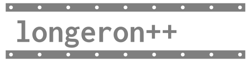

 

*Structure for your framework*


Longeron++ is a C++17 header-only library that aims to provide simple solutions for representing a program's state for efficient (parallel) processing, motivated by *Data-Oriented Design*. By providing a set of containers focused on representing objects with an integer ID, this library works as a flexible, simple, and more performant alternative to traditional Object-Oriented Design.

**Intended Applications:**

* ECS Game Engines
* Desktop Applications
* Managing index and vertex buffers for GPUs
* Embedded Systems
* anything really.

*Careful, this library is still in early development! API is not stable. Contributions, bug reports, and suggestions are welcome!*

## Introduction

First off, make sure you at least have a rough idea of what Data-Oriented Design is.

See: [Data Oriented Design Resources](https://github.com/dbartolini/data-oriented-design)

The rise of Data-Oriented Design highlights many unnecessary difficulties associated with (class-based) Object-Oriented Design. Not only in terms of performance, but also the explosive complexity of class hierarchies, scattered states, deep call stacks, tedious refactoring, tangled spaghetti messes of references everywhere, etc...

In short, object orientation is often not the best tool for your particular problem.

Many of the Data-Oriented Design resources go over the same ideas, such as CPU caches, structure of arrays, and data transformations. Their resulting solutions are simple, performant, and maintainable; however, a few admit to losing flexibility. The only well-known Data-Oriented alternative to 'objects' was realized in the form of the "Entity-Component-System" (ECS) architecture used in very modern game engines.

See: [Entity Component System FAQ](https://github.com/SanderMertens/ecs-faq)

Personally I find that many ECS implementations don't really capture the true essence of what ECS should really be. Treating 'entities' as 'objects' led to many of the same problems in object-oriented. Almost all implementations feature a centralized registry/world class that handles *everything*, which need to be very complex to fit everyone's use cases. Additionally, trying to fit *every* problem around entities and components is a mistake. For example, trying to use [EnTT](https://github.com/skypjack/entt/) for a [Falling-Sand Game](https://wikipedia.org/wiki/Falling-sand_game) simply fell apart as 2D grids are just best represented by 2D arrays, not entities and components.

From working on a [spaceflight simulator](https://github.com/TheOpenSpaceProgram/osp-magnum) (specifically planet terrain mesh) and various circuit simulators, many ECS-like patterns started to emerge. It turns out the core ideas of ECS go far beyond just ECS and game development. This was the beginning of Longeron++.

## Features

### Id Management

One of the core ideas of Longeron++ is to represent instances of 'things' as integer IDs. These can be useful for general memory management, as well as things like managing vertex and index buffers for computer graphics.

* **IdRegistry**: Manages sequential integer IDs
  ```cpp
  lgrn::IdRegistry<int> registry;
  
  int idA = registry.create(); // returns 0
  int idB = registry.create(); // returns 1
  int idC = registry.create(); // returns 2
  
  registry.remove(idB);
  
  int idD = registry.create(); // returns 1, reused
  ```
  Internally relies on a single HierarchicalBitset. Deleted IDs are reused in ascending order. Enum classes can be used as IDs instead of plain integers.
  
TODO: IdStorage, UniqueIdRegistry, RefCount

### Containers

Containers only allocate memory on construction or explicit resizing.

* **HierarchicalBitset**: Uses a hierarchy of bit arrays to represent a range of integers with low memory usage and fast iteration speeds.
  ```cpp  
  lgrn::HierarchicalBitset bitset(512); // allocate space for 512 bits
  
  bitset.set(69);
  bitset.set(42);
  bitset.set(420);
  
  for (std::size_t bitNum : bitset)
  {  
      // outputs 42, 69, then 420 (ascending order)
      std::cout << bitNum << "\n";
  }
  ```
  This works great as dirty flags or grouping together IDs that need iteration.

* **IntArrayMultiMap**: Uses internal integer arrays to map IDs (keys) to variable-sized arrays of data. Stored data is contiguous in memory, but can get fragmented when elements are removed.
  ```cpp  
  // use ints as IDs, use float as data. 16 max floats, 4 max IDs
  IntArrayMultiMap<int, float> multimap(16, 4);

  // Emplace some 'partitions' associated with IDs 0 to 2
  multimap.emplace(0, {1.0f, 2.0f});
  multimap.emplace(1, {3.0f, 4.0f, 5.0f});
  multimap.emplace(2, {6.0f, 7.0f, 8.0f, 9.0f});  
  
  // in memory: [1.0f, 2.0f, 3.0f, 4.0f, 5.0f, 7.0f, 8.0f, 9.0f, ... ]
  
  std::cout << multimap[2][2] << "\n"; // prints 8.0f  
    
  // remove 1 and pack
  multimap.erase(1);  
  multimap.pack();  
    
  // in memory: [1.0f, 2.0f, 6.0f, 7.0f, 8.0f, 9.0f, ... ]
  ```
  
  If moving data during packing is a heavy operation, the `pack(n)` function accepts a max number of moves, intended to spread moves across a couple frames.
  
  This container is originally made for elements in circuit simulators to have multiple connections, such as an AND gate that accepts a variable number of inputs.
  
## Principles

Longeron has an *intended use*, though this isn't at all strict:

* **Use contiguous arrays for multiple objects, avoid many individual allocations**
  * For good cache locality
  * Accessible by array index

* **Prefer indices/IDs over pointers for storing long-term references**
  * A single array index can refer to many arrays of different types; a pointer can only refer to one type.
  * The arrays themselves can be passed as function parameters.
  * Data can reallocate safely.
  * Easier to serialize.

* **Store data based on how it's used, not by what it composes (aka: Structure of Arrays)**
  * Data that composes a single 'thing' does not need to be stored in the same structure.
  * Easier to split into different threads or subsystems.
  * Combined with IDs, this can be considered a relational database.

* **Separate relationships from data** 
  * Hierarchies, string names, connections, and mappings can use specialized containers that map IDs values.
  * Allows fast iteration over relationships by not needing to access data.
  * Allows many different relationships to exist simultaneously.

* **Pass the 'minimum required' function parameters to reduce dependencies**
  * For example, a game object in a game world would often need to store a reference to the game world it's part of. This is unnecessary complexity, as every time a game object is accessed, the world is very likely easily accessible as well. Simply pass the world as a function parameter instead of a member.
  * If a function accepts a large class/struct, but the function only accesses one or a few members, consider passing the individual members instead. The function will no longer depend on the large class/struct.
  * Stack allocations are practically free.

## Example usage

Let's write a simulation-like program that requires a world that consists of 'Things' that contain data. Each thing can be looked up by name:

```cpp
struct Thing
{
    DataA m_dataA;
    DataB m_dataB;
}

struct World
{
    std::map<std::string, Thing> m_things;
}
```

This is a completely normal way to approach the problem, though it is not without flaws:

* We might not want to be referring to `Thing`s by their name internally, nor do we want to use map iterators. The existence of a `Thing` is ultimately coupled to its name, which we might not actually need most of the time.
* It's hard to separate concerns if `Thing` is needed in several unrelated tasks. Imagine in the case of a game, if DataA is for physics, and DataB is for drawing. It would be hard to separate the physics and drawing systems if both of their required data are bundled into `Thing`.
* Cache locality is questionable

Following our principles, let's instead use the IdRegistry to generate IDs for `Thing`s. The name relationship can be separated by mapping string names to IDs:

```cpp

enum class ThingId : uint32_t { };

struct World
{
    lgrn::IdRegistry<ThingId> m_ids;

    std::map<std::string, ThingId> m_byName;
    
    // TODO: data
}

```

For how the data is represented, we have several different options to choose from. Any solution that associates `ThingId` to some data is a working solution.

**Option 1: Sparse vectors**

* use ThingId as an array index

```cpp
std::vector< std::optional<DataA> > m_dataA;
std::vector< std::optional<DataB> > m_dataB;
```

**Option 2: Maps**
* who cares about performance, just make the data separate!

```cpp
std::map<ThingId, DataA> m_dataA;
std::map<ThingId, DataB> m_dataB;
```

**Option 3: Dense vectors with Hierarchical Bitset**
* TODO: make this into some kind of container built into this library
* Set bits in HierarchicalBitset are in parallel with the vectors
* Iteration needed to get data by ID, no random access
```cpp
lgrn::HierarchicalBitset<uint64_t> m_existsA;
std::vector<DataA> m_dataA;

lgrn::HierarchicalBitset<uint64_t> m_existsB;
std::vector<DataB> m_dataA;
```

**Option 4: Use [EnTT](https://github.com/skypjack/entt/)'s basic_storage (sparse set)**
* Fast iteration and O(1) random access
* EnTT library needed of course
```cpp
entt::basic_storage<ThingId, DataA> m_dataA;
entt::basic_storage<ThingId, DataB> m_dataB;
```

The point is, **the programmer is now free to organize the data in any way they prefer**, being able to choose a solution that best fits the problem.

## Entity Component System

The above example is a way to store entities (ThingId) and components (DataA, DataB). Longeron++ favours a more 'pure' ECS approach. 'Systems' in ECS are simply just functions and nothing more. Users are free to write abstractions around systems, though this is [not recommended](https://github.com/TheOpenSpaceProgram/osp-magnum/pull/93).


```cpp

// Possible ways to write system functions:

// Pass the whole world, not recommended as it depends on World; do only out of laziness.
void system_a( World& rWorld )
{
    ...
}

// Pass container(s) by reference
void system_a( entt::basic_storage<ThingId, DataA> &rDataA )  
{
    for (...)
}

// Iterators (damn easy to parallelize, perhaps some kind of std::span may work too)
void system_a( iterator first, iterator last )
{
    for (...)
}

// Main loop

while (running)
{
    system_a(world.m_dataA);
    system_b(world.m_dataB);
    system_c(world.m_dataA, world.m_dataB); // taking multiple components
}

```

Knowing exactly which components a system will modify will make parallelism nearly trivial.

### Deleting entities

To stay with a pure systems approach, entities that are going to be deleted must be added to a container, such as a vector or HierarchicalBitset. Individual systems can then delete their corresponding components.

```cpp

struct World
{
    ...  
    // also allowed to make these per thread :)
    HierarchicalBitset m_toDelete;
}
  
// main loop

while (running)
{
    // system that can request to delete entities, writes to world.m_toDelete
    system_something(world.m_dataA, world.m_toDelete);
  
    // Delete DataA components
    system_delete_a(world.m_dataA, world.m_toDelete);
    // Delete DataB components, can run in parallel with above
    system_delete_a(world.m_dataB, world.m_toDelete);  
    
    // clear deleted entities for next frame
    world.m_toDelete.reset();
}

```


### Systems that create entities

Solution: don't. Entity creation should happen in one place. Systems can return a value to request entities.

```cpp

std::vector<ThingId> newIds;

while (running)
{
    int entitiesRequired = system_create_calculate_required(world.m_dataA);
    
    if (entitiesRequired != 0)
    {
        newIds.resize(entitiesRequired);  
          
        // create multiple IDs, store in newIds
        world.m_ids.create(std::begin(newIds), entitiesRequired);
          
        // pass in newly created IDs to the next system
        system_create_resume(world.m_dataA, newIds);  
        newIds.clear();
    }
}

```

### Message passing

*Real message passing this time. Dynamic Dispatch is Not Message Passing (DDINMP)*

If you think about it very carefully, entities and components are simply persistent messages passed between systems. For example, entities and components that describe a solid cube is a way for a physics system to communicate with a render system. 

System functions can easily accept queues and other values that aren't considered components.

### Centralized world?

*Data that composes a single 'thing' does not need to be stored in the same structure.*

This applies to the entire world too.

```cpp

struct World
{
    lgrn::IdRegistry<ThingId> m_ids;
    
    entt::basic_storage<ThingId, DataA> m_dataA;
    entt::basic_storage<ThingId, DataB> m_dataB;
}

// Separate the entire renderer, ez.
struct WorldRenderer
{
    entt::basic_storage<ThingId, Transform> m_transforms;
    entt::basic_storage<ThingId, OpenGLTexture> m_texture;
}

// ...

main_render_function(world, worldRenderer);

```

## Real examples

*More examples coming soon: a voxel game and various circuit simulators*

### OSP-Magnum

It doesn't use Longeron++ specifically, but this is where Longeron++ is based off of. It uses EnTT and other 3rd party libraries.

* [ECS Engine Test](https://github.com/Capital-Asterisk/osp-magnum/blob/40d051ff969a9f4e5feb9cd2c7b61f0e514b2591/src/test_application/activescenes/scenarios_enginetest.cpp)  - draws a spinning cube
* [ECS Physics Test](https://github.com/Capital-Asterisk/osp-magnum/blob/40d051ff969a9f4e5feb9cd2c7b61f0e514b2591/src/test_application/activescenes/scenarios_physicstest.cpp)  - see [osp-magnum PR 161](https://github.com/TheOpenSpaceProgram/osp-magnum/pull/161)


## Notes

* A longeron is one of the main structural elements of an aircraft or similar vehicle used in aerospace. This relates to the project's roots in OSP-Magnum, which is a spaceflight simulator.
