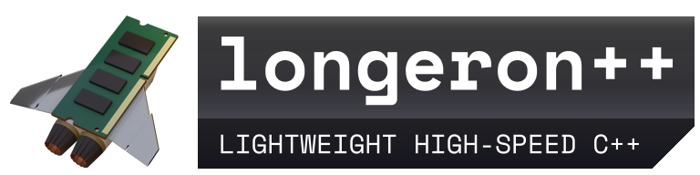

 

*Structure for your framework (not a framework itself)*

Longeron++ is a C++17 header-only library that aims to provide ridiculously simple solutions for representing a program's state for efficient (parallel) processing. Motivated by *Data-Oriented Design*, this library likely favors procedural and functional styles.

**Intended Applications:**

* ECS Game Engines
* Desktop Applications
* Embedded Systems
* anything really.

*Careful, this libary is still in early development! Contributions, bug reports, and suggestions are welcome!*

## Introduction

The rise of Data-Oriented Design highlights many unnecessary difficulties associated with (class-based) Object-Oriented Design. The state of an object-oriented program is often scattered across many complex classes, storing references and calling each other's methods. This is difficult to reason with at large scales, and easily turns to spaghetti. Good object-oriented code is possible, but requires lots of abstractions, sacrifice of performance, and years of experience. If you pay for a fast computer but run slow code, then you wasted your money. In short, object orientation may often not be the best tool for your particular problem.

*There are lots of OOP rants, just go look for some*

Ignoring objects, the state of any program can always be represented as just *data*: integers, floats, structs, arrays, maps, etc... There are many different ways this data can be organized to do the same task, but the best solutions will favor low complexity and ease of processing. 

Most programmers don't care about how the data is arranged in memory, but at least keep this in mind:

**Arrays = Fast**

Arrays are the most cache friendly and easiest to parallelize data structure of all, whether through SIMD, multithreading, or both. However, representing a program's state to utilize arrays is not trivial; so here's where Longeron++ comes in.

## Features

### Containers

* **HierarchicalBitset**: Uses a hierarchy of bit arrays to represent a range of integers with low memory usage and fast iteration speeds.

### Id Management

* **IdRegistry**: Manages reusable runtime sequential IDs 

TODO

## Principles

Longeron has an *intended use*, though this isn't at all strict:

* **Use contiguous arrays and avoid many individual allocations**
  * As mentioned, arrays are cool.

* **Prefer indices/IDs over pointers for storing long-term references**
  * A single array index can refer to many arrays of different types; a pointer can only refer to one type.
  * The arrays themselves can be passed as function parameters.
  * Data can reallocate safely.
  * Easier to serialize.

* **Store data based on how it's used, not by what it composes (aka: Structure of Arrays)**
  * Data that composes a single 'thing' does not need to be stored in the same structure.
  * A problem may be easier to split into different threads or subsystems.
  * Combined with IDs, this can be considered a relational database.

* **Separate relationships from data** 
  * Hierarchies, connections, and mappings can use specialized containers that use IDs as values.
  * Allows fast iteration over relationships by not needing to access data.
  * Allows many different relationships to exist simultaneously.

* **Pass the 'minimum required' function parameters to reduce dependencies**
  * For example, a game object in a game world would often need to store a reference to the game world it's part of. This is unnecessary complexity, as every time a game object is accessed, the world is very likely easily accessible as well. Simply pass the world as a function parameter instead of a member.
  * If a function accepts a large class/struct, but the function only accesses one or a few members, consider passing the individual members instead. The function will no longer depend on the large class/struct.
  * Stack allocations are practically free.

## Example usage

Let's write a simulation-like program that requires a world that consists of 'Things' that contain data. Each thing can be looked up by name:

```cpp
struct Thing
{
    DataA m_dataA;
    DataB m_dataB;
}

struct World
{
    std::map<std::string, Thing> m_things;
}
```

This is a completely normal way to approach the problem, though it is not without flaws:

* We might not want to be referring to `Thing`s by their name internally, nor do we want to use map iterators. The existence of a `Thing` is ultimately coupled to its name, which we might not actually need most of the time.
* It's hard to separate concerns if `Thing` is needed in several unrelated tasks. Imagine in the case of a game, if DataA is for physics, and DataB is for drawing. It would be hard to separate the physics and drawing systems if both of their required data are bundled into `Thing`.
* Cache locality is questionable

Following our principles, let's instead use the IdRegistry to generate IDs for `Thing`s. The name relationship can be separated by mapping string names to IDs:

```cpp

enum class ThingId : uint32_t { };

struct World
{
    lgrn::IdRegistry<ThingId> m_ids;

    std::map<std::string, ThingId> m_byName;
    
    // TODO: data
}

```

For how the data is represented, we have several different options to choose from. Any solution that associates `ThingId` to some data is a working solution.

**Option 1: Sparse vectors**

* use ThingId as an array index

```cpp
std::vector< std::optional<DataA> > m_dataA;
std::vector< std::optional<DataB> > m_dataB;
```

**Option 2: Maps**
* who cares about performance, just make the data separate!

```cpp
std::map<ThingId, DataA> m_dataA;
std::map<ThingId, DataB> m_dataB;
```

**Option 3: Dense vectors with Hierarchical Bitset**
* TODO: make this into some kind of container built into this library
* Set bits in HierarchicalBitset are in parallel with the vectors
* Iteration needed to get data, no random access by ID
```cpp
lgrn::HierarchicalBitset<uint64_t> m_existsA;
std::vector<DataA> m_dataA;

lgrn::HierarchicalBitset<uint64_t> m_existsB;
std::vector<DataB> m_dataA;
```

**Option 4: Use EnTT's basic_storage (sparse set)**
* EnTT library needed of course
```
entt::basic_storage<ThingId, DataA> m_thingDataA;
entt::basic_storage<ThingId, DataB> m_thingDataB;
}
```

The point is, the programmer is now free to organize the data in any way they prefer, being able to choose a solution that best fits the problem.

## Notes

* A longeron is one of the main structural elements of an aircraft or similar vehicle used in aerospace. Besides being a cool word, this project stems from [osp-magnum](https://github.com/TheOpenSpaceProgram/osp-magnum).
