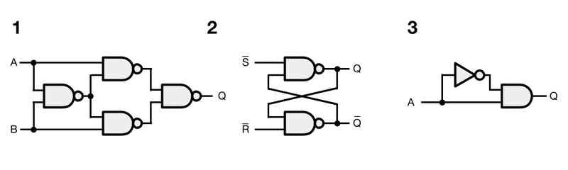

# Longeron Circuit Simulator

An example digital logic simulator utilizing Longeron++ and its associated principles.

Features:
 * All basic logic gates: AND, OR, XOR, and other common variants
 * Correct Sequential Logic
 * Few memory allocations needed for a large number of circuit elements
 * Easily multithread-able (but not yet implemented) 

Only the basics are featured so far, but is designed to be extended to other datatypes and more complex circuit elements. This is not just a throwaway example; its architecture can scale up with very little modification.

Future ideas:
* Simulate an entire CPU (possible now, but will take lots of effort)
* Implement analog values and filters to make a modular synthesizer
* Implement realistic voltage levels and currents for electronics-level simulations

Aside from digital logic, similar (or exactly the same) techniques used can be useful for connecting entities in a game, or as an **efficient alternative to the observer pattern, signals, or events**.

## Introduction

Digital logic circuits are a perfect problem that feature *separate things that communicate with each other.*

Here are some examples of some logic circuits I'd like to deal with:
 

*Example circuits*

1. **XOR using NAND gates:** A combinational circuit that implements XOR. Combinational circuits can be described as pure functions, where each combination of inputs has a deterministic output.
2. **NAND S-R Latch:** A sequential circuit that can store 1 bit of memory, which can be set, reset, or latched depending on its inputs. Sequential circuits store state, and cannot be represented by a function. 
3. **Edge Detector:** An (asynchronous?) sequential circuit that depends on delays. If input `A` starts at 0, then the output of the inverter starts at 1. If `A` then rises to 1, the AND gate will see both of its inputs as 1 for a short instant. It takes time for the inverter's output to change to 0, resulting in a tiny pulse released from the AND gate.

Longeron Circuit Simulator is designed to flawlessly support all three of these circuits without the possibility of order-dependent issues, while being surprisingly simple and optimized for a large number of circuit elements.

Sample output
```
XOR made from NAND gates:
* 0 XOR 0 = 0
* 0 XOR 1 = 1
* 1 XOR 0 = 1
* 1 XOR 1 = 0
NAND SR latch:
* set...    Q = 1
* retain... Q = 1
* reset...  Q = 0
* retain... Q = 0
Edge Detector:
 In[A]: __##____#___######____#######___
Out[A]: __#_____#___#_________#_________
```

## Previous (flawed) approaches

My need for a circuit simulator first arose as a solution to wiring together parts in a simulated spacecraft for a game. Instead of hard-coding controls into each individual part, I though about using a wiring system to control thruster levels with user inputs, autopilots, sensors, and control systems. I was inspired by an electronics background and a GMod addon known as Wiremod.

[The first attempt](https://github.com/TheOpenSpaceProgramArchive/urho-osp/blob/master/src/Machines/Wire.h) uses smart pointers and vectors of connections. Requesting a value will recursively call a chain of connected elements. This is not very efficient, can only simulate combinational logic, suffers for order-dependent issues, and cannot handle loops.

The space project was recoded, and superior ideas were implemented in the recode. As a result of long conversations on Discord, I ended up writing the jokingly named [SDL series of circuit simulators](https://gist.github.com/Capital-Asterisk/97652b9820023c100dffac7a35c331dd), standing for "Stupid Digital Logic."

SDL architectures consist of classes that have update functions. Each subsequent version of SDL is an improvement upon its predecessor:

* **SDL 1:**
  * Likely broken, updates circuit elements in a specific order
* **SDL 2:**
  * Separates 'calculate' and 'propagate' update functions to stop order-dependent issues. Every output is buffered, and is all changed at once.
  * Uses Dirty vectors (vector of which things changed for more efficient updates)
  * Simulates sequential logic correctly
* **SDL 3:** 
  * Introduces *nodes*\* and integer IDs to stop elements from directly referring to each other.
  * Indicates an ECS and modern C++ obsession (but is still horribly prematurely generalized)

All SDL simulators take a 'OOP' approach, where **states of each circuit element is bundled together in a class**. This is common with many other circuit simulator examples out there (do a google search!).

Breaking from this part of the OOP mindset is incredibly difficult.

### Importance of Nodes

Basic logic gates are pure functions. They should not store any state. However, they can be arranged in ways that do store state, noting the SR latch above.... *what*? This is because the intermediate values on the connections (Nodes) is what matters the most, determining the state of the circuit.

The [terminology for Node](https://en.wikipedia.org/wiki/Node_(circuits)) comes from electrical engineering. When analyzing real electronic circuits, the only purpose of circuit elements are to create equations that relate nodes. Logic gates are exactly the same:

```
NodeOut = NodeA AND NodeB
```

Circuit elements connected together simply share the same nodes (or separate nodes set equal in an equation).

This may also highlight that objects themselves are not important, and it's the interactions between them that matter. OOP may be how a regular person sees the world, but it's not how a scientist or engineer would see it.

Node can be compared to interfaces, or any 'message passing medium.' The source of coupling and complexity often comes from objects directly referring to each other.


## The Longeron++ way

See [circuits.hpp](circuits.hpp).

To represent the state of a circuit in a computer, we take a direct approach:

* Which circuit elements exist, and what type are they? -> `struct Elements`
* How are the circuit elements connected? -> `struct Nodes`
* What values are on the Nodes? -> `struct NodeValues`

This allows creating and connecting together circuit elements and nodes without needing to know their types.

Also consider how thinking in terms of **individual** circuit elements would lead to a different (overcomplicated) solution.

### Stepping the circuit through time

To prevent order-dependent issues, Node values need to be buffered. This is implemented through `struct UpdateNodes`.

Values can be inputted into the circuit by writing to `UpdateNodes`. Afterwards, a few operations steps the circuit:

1. Read `UpdateNodes` and write new node values.
2. Clear UpdateNodes
3. For each circuit element, calculate their new output values and store in UpdateNodes.

This assumes that each circuit element has the same *propagation delay*. Changes caused by new values will propagate though a single logic gate per step. This means circuits require multiple steps for new inputs to affect its output.

Steps can be looped until no more changes are detected, though the max number of steps should be limited as some circuits will oscillate (ie. an inverter connected to itself). This maximum can be chosen considering real-life logic gate propagation speeds (30ns for a 74HC04 Inverter).

### Publisher-Subscriber

"For each circuit element" above means updating every single circuit element each step. But consider that if we have a line of 8000 connected logic gates, it would take 8000*8000 updates for an input change to propagate to the output. If we had a way to only update elements whose inputs have changed, then we only need 8000 updates.

This calls for a publisher-subscriber scheme that sets dirty flags. When a new value is written to a node, elements that are subscribed to the node can be marked for update. Publisher and subscriber info are kept in the `Nodes` struct using `lgrn::IntArrayMultiMap`.

### Efficient Dirty Flags

Working in tandem with subscribers, the dirty flags themselves are implemented as bitsets using `lgrn::BitView`. Bitsets can efficiently represent a sorted range of unique integers and are fast to iterate, perfect! Using 64-bit ints means 64 bits can be checked at once.

Positions of dirty ids are set as 1, and the 1 bits are iterated.

Dirty flags are used for both Nodes and Elements, handled by `struct UpdateNodes`, and `struct UpdateElem`.

* Nodes are marked dirty when assigned new values by element updates (`update_combinational(...)`)
* Elements are marked dirty when a node they are subscribed to changes, occurring in node updates (`update_nodes(...)`)

Additionally, bitsets can be ORed together. This may work as a way to combine results from multiple worker threads.

A hierarchical bitset can be used too, but the current implementation is kind of ugly. This won't improve worse case performance either (when all ints in the bitset are non-zero).